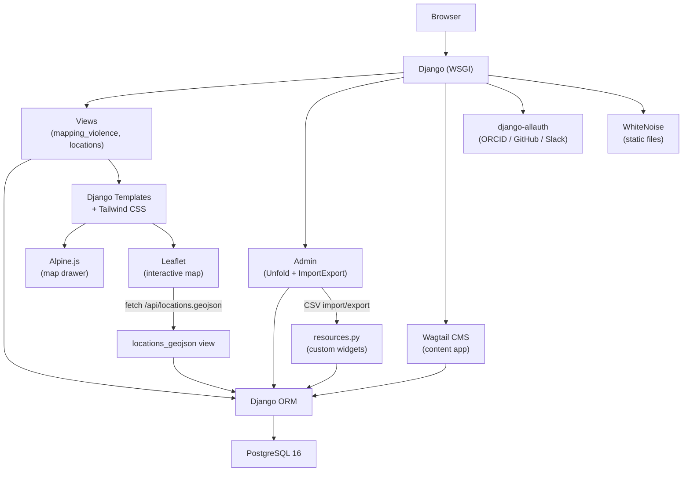

# AGENTS.md

> For feature specifications, business rules, and domain models, see [SPEC.md](./SPEC.md).

---

## Table of Contents

- [Project Overview](#project-overview)
- [Tech Stack](#tech-stack)
  - [Package Management](#package-management)
  - [Backend](#backend)
  - [Frontend](#frontend)
  - [Database](#database)
- [Project Initialization](#project-initialization)
- [Project Structure](#project-structure)
- [Architecture](#architecture)
  - [System Architecture Diagram](#system-architecture-diagram)
  - [REST API Design](#rest-api-design)
- [Authentication & Authorization](#authentication--authorization)
  - [User Auth](#user-auth)
  - [API Auth](#api-auth)
- [Development Workflow](#development-workflow)
  - [Version Control](#version-control)
  - [Database Migrations](#database-migrations)
  - [Debugging & Logging](#debugging--logging)
  - [Serving the Application](#serving-the-application)
  - [Testing Approach](#testing-approach)
- [Best Practices & Key Conventions](#best-practices--key-conventions)
- [Notes for AI Agents](#notes-for-ai-agents)

---

## Project Overview

**Mapping Violence** is a Django-based digital humanities research application for documenting, analyzing, and visualizing patterns of interpersonal violence in early modern Italy (primarily Venice and surrounding regions, 16th–17th centuries). It is developed at the Roy Rosenzweig Center for History and New Media (CHNM).

The application serves two audiences:
- **Researchers / data entry team** — enter, import, and analyze structured crime records via the admin and data table
- **Public scholars and students** — browse the interactive map and crime database; read project content pages

Core capabilities:
- Structured database of violence events linking people (victims, perpetrators), locations, weapons, court proceedings, and outcomes
- Interactive Leaflet map with filtering and color-by visualization modes
- CSV import/export pipeline for bulk data loading
- Wagtail CMS for project narrative and team pages
- Invite-only authentication (no public signup)

---

## Tech Stack

**Python** 3.12 · **Django** 5.1+ · **PostgreSQL** 16 · **Wagtail** 7.1 · **Tailwind CSS** · **Leaflet** · **Alpine.js**

### Package Management

- **`uv`** — Python package manager and runner (replaces pip/poetry). All Python commands use `uv run <command>`.
- `pyproject.toml` is the single source of truth for dependencies and tool config.
- No `.nvmrc`/Node version pinning; Tailwind build is managed via `python-tailwind` which wraps npm internally.

Key `pyproject.toml` scripts are not defined; use `make` targets (see [Serving the Application](#serving-the-application)) or `uv run manage.py <command>` directly.

### Backend

- **Django 5.1+** — web framework, ORM, admin
- **Wagtail 7.1** — CMS layer for content pages (GeneralPage, snippets)
- **django-allauth** — authentication with social login support (ORCID, GitHub, Slack)
- **django-unfold** — replaces the default Django admin UI
- **django-filter** — declarative queryset filtering (`CrimeFilter` in `mapping_violence/filters.py`)
- **django-tables2** — renders the paginated crime table
- **django-import-export** — CSV import/export on `CrimeAdmin` with custom resource widgets
- **django-autocomplete-light** — autocomplete selects for Person M2M fields in the admin
- **edtf** — Extended Date Time Format parsing for uncertain historical dates
- **geopy** — Nominatim geocoding for Location coordinates
- **whitenoise** — static file serving in production

### Frontend

- **Tailwind CSS** — utility-first styling; source in `theme/static_src/`, compiled to `theme/static/css/`
- **Alpine.js** — lightweight reactivity for the map drawer (loaded from CDN)
- **Leaflet 1.9.4** — interactive map (loaded from CDN)
- Django templates with `` inheritance from `templates/base.html`
- No JS build pipeline beyond Tailwind; no bundler (Vite/Webpack/etc.)

### Database

- **PostgreSQL 16** — primary datastore
- **Django ORM** — all queries go through the ORM; no raw SQL except in migrations
- No PostGIS — geographic data stored as `DecimalField` lat/lng pairs, not geometry types
- No caching layer (Redis/memcached) — not currently configured
- No full-text search engine — filtering is ORM-based with `icontains` lookups

---

## Project Initialization

**Prerequisites:** Python 3.12+, `uv`, PostgreSQL 16, Node.js (for Tailwind)

```bash
# 1. Clone
git clone <repo-url>
cd mapping_violence

# 2. Install Python dependencies
uv sync

# 3. Create .env from example (no .env.example exists — create manually)
cat > .env <<EOF
SECRET_KEY=your-secret-key-here
DB_HOST=localhost
DB_PORT=5432
DB_NAME=mapping_violence
DB_USER=mapping_violence
DB_PASS=password
DEBUG=True
EOF

# 4. Create PostgreSQL database
createdb mapping_violence

# 5. Run migrations
make migrate

# 6. Load seed fixtures
make fixtures           # loads weapon_types.json

# 7. Create superuser
make superuser

# 8. Install Tailwind dependencies and build CSS
uv run manage.py tailwind install
make tailwind           # starts watcher; run in a separate terminal

# 9. Start dev server
make preview            # http://localhost:8000
```

Optional: load source data CSVs via Django admin → Crime → Import.

---

## Project Structure

```
mapping_violence/
├── config/                  # Django settings, root URLs, allauth adapter
│   ├── settings.py
│   ├── urls.py
│   └── adapters.py          # NoSignupAdapter (disables self-registration)
├── mapping_violence/        # Core domain app
│   ├── models.py            # Crime, Person, Weapon, Event, Witness, PersonRelation
│   ├── admin.py             # CrimeAdmin, PersonAdmin, WeaponAdmin, etc.
│   ├── views.py             # index, crime_list, crime_detail
│   ├── filters.py           # CrimeFilter (django-filter)
│   ├── tables.py            # CrimeTable (django-tables2)
│   ├── resources.py         # Import/export resource classes and custom widgets
│   ├── forms.py             # CrimeForm, PersonForm (admin widgets)
│   └── migrations/
├── locations/               # Geographic data app
│   ├── models.py            # City, Location (with coordinate fallback property)
│   ├── views.py             # map_view, locations_geojson
│   └── migrations/
├── historical_dates/        # EDTF uncertain date handling
│   ├── models.py            # HistoricalDate model
│   ├── fields.py            # HistoricalDateField custom model field
│   └── migrations/
├── content/                 # Wagtail CMS app
│   ├── models.py            # HomePageContent, ProjectPerson snippets; GeneralPage
│   └── migrations/
├── theme/                   # Tailwind CSS
│   ├── static_src/          # Tailwind source (tailwind.config.js, src/styles.css)
│   └── static/css/          # Compiled output
├── templates/               # Root-level templates (base.html, error pages, account/)
├── theme/templates/         # App-specific templates
│   ├── crimes/              # list.html, detail.html
│   ├── locations/           # map.html
│   ├── content/             # home.html, page.html, snippets/
│   └── includes/            # Reusable partials
├── static/                  # Project static assets
├── staticfiles/             # Collected static (production, gitignored)
├── mediafiles/              # Uploaded media (gitignored)
├── fixtures/                # weapon_types.json seed data
├── static-data/             # Source CSV files for bulk import
├── Makefile
└── pyproject.toml
```

Templates follow Django's app-template lookup order. App templates live in `theme/templates/<app>/` (via the `theme` app's `DIRS`), not in each app's own `templates/` folder.

---

## Architecture

### System Architecture Diagram



Data entry flow: researchers upload CSVs → CrimeAdmin import → custom `PersonWidget`/`WeaponWidget`/`LocationWidget` resolve references via `get_or_create` → records stored in PostgreSQL.

Public view flow: visitor loads `/map/` → Leaflet fetches `/api/locations.geojson` with filter params → Django queries Crime/Location data → returns GeoJSON → Leaflet renders colored circle markers.

### REST API Design

The application exposes one JSON endpoint (not a full REST API):

**`GET /api/locations.geojson`**

Returns a GeoJSON FeatureCollection of Location points with embedded crime data.

Query parameters (all optional):

| Parameter | Type | Description |
|-----------|------|-------------|
| `city` | integer | City primary key |
| `crime_type` | string | Exact match on `Crime.crime` |
| `year_from` | integer | `Crime.year >= year_from` |
| `year_to` | integer | `Crime.year <= year_to` |
| `weapon_category` | string | Matches `Weapon.weapon_category` choices |

Response shape per feature:
```json
{
  "type": "Feature",
  "geometry": { "type": "Point", "coordinates": [lng, lat] },
  "properties": {
    "id": 1, "name": "...", "city": "...", "category": "...",
    "crime_count": 3,
    "crimes": [
      {
        "id": 1, "crime": "assault", "number": "ABC-001",
        "date": "1542-03-15", "year": 1542,
        "fatality": false,
        "victim_gender": "M",
        "perpetrator_gender": "U"
      }
    ]
  }
}
```

Color-by mode (`crime_type`, `fatality`, `gender`) is handled entirely client-side in `map.html`; the API always returns all fields.

---

## Authentication & Authorization

### User Auth

- **django-allauth** handles all authentication
- Self-registration is disabled via `NoSignupAdapter` in `config/adapters.py` — accounts are created by a superuser only
- Social login supported: ORCID, GitHub, Slack (configured via env vars; only enabled if keys are present)
- Email verification: optional (`ACCOUNT_EMAIL_VERIFICATION = "optional"`)
- Sessions are Django's default database-backed sessions
- `/accounts/` — allauth URL namespace; `/accounts/profile/` — post-login redirect

### API Auth

- No API authentication — the GeoJSON endpoint (`/api/locations.geojson`) is publicly accessible (read-only)
- Admin (`/admin/`) and CMS (`/cms/`) require Django session authentication
- CSRF protection is active on all POST endpoints (standard Django middleware)

---

## Development Workflow

### Version Control

- **Branching:** feature branches off `main`; naming: `feat/`, `fix/`, `refactor/`, `docs/`
- **Commit messages:** Conventional Commits — `feat:`, `fix:`, `refactor:`, `chore:`, `docs:`
- **Main branch:** `main` (production); PRs merge here
- **Pre-commit hooks** enforce code quality automatically — see [Best Practices](#best-practices--key-conventions)

### Database Migrations

```bash
make mm          # python manage.py makemigrations
make migrate     # python manage.py migrate
```

- Migrations live in each app's `migrations/` folder
- Name migrations descriptively when using `--name`: `0007_add_nationality_ethnicity_and_sentence_in_absentia`
- Never edit a migration that has been applied in production; create a new one instead
- After any model change, always run `make mm` before `make migrate`

### Debugging & Logging

- **django-debug-toolbar** is installed and active when `DEBUG=True`; accessible via the toolbar panel on any HTML page at `/__debug__/`
- Django's default logging writes to the console in development
- `make shell` opens a Django shell for interactive ORM queries

### Serving the Application

**Development:**
```bash
make preview     # http://localhost:8000
make tailwind    # run in a second terminal to watch/compile CSS changes
```

**Production:**
- Static files collected with `make collectstatic` → served by WhiteNoise
- Media files served from local `mediafiles/` or S3-compatible object storage (set `OBJ_STORAGE` env var)
- No specific deployment platform is configured in the repo; deploy as a standard Django WSGI app

### Testing Approach

- **Framework:** pytest-django
- Test files live alongside app code: `mapping_violence/tests.py`, `locations/tests.py`, `historical_dates/tests.py`, `content/tests.py`
- `mapping_violence/test_location_widget.py` tests the import-export widget logic

```bash
uv run pytest                        # all tests
uv run pytest mapping_violence/      # single app
uv run pytest -k "test_widget"       # single test by name
uv run pytest --tb=short             # shorter tracebacks
```

Test coverage is currently sparse — the framework is wired up but most test files are thin. New features should add tests, especially for model methods, import widgets, and filter logic.

---

## Best Practices & Key Conventions

**Code style — enforced by pre-commit hooks:**
- **ruff** — linting and formatting for Python (replaces flake8 + black)
- **isort** — import ordering
- **djhtml** — Django template indentation formatting
- Standard hooks: trailing whitespace, end-of-file newline, JSON/YAML validation

When a pre-commit hook reformats a file on the first commit attempt, re-`git add` the changed files and commit again. This is expected behavior.

**Naming:**
- Models: singular (`Crime`, `Person`, `Location`)
- Apps: domain-descriptive (`mapping_violence`, `locations`, `historical_dates`, `content`)
- `__str__` methods are defined on all models; Person returns `"Last, First"` format
- Help text is written on all data-entry fields to guide researchers

**Query patterns:**
- Use `select_related()` for FK chains on detail views (e.g., `crime_detail` prefetches location, city, weapon, people)
- Use `prefetch_related()` for M2M (victim, perpetrator) — especially in `locations_geojson` where per-crime gender data is needed
- Annotate at the queryset level (`Count("crime", distinct=True)`) before iterating

**Template organization:**
- App templates go in `theme/templates/<app>/` (not in the app's own `templates/` dir)
- Partials/includes go in `theme/templates/includes/`
- Base template is `templates/base.html`

**Admin patterns:**
- All admin classes should have `list_display`, `list_filter`, and `fieldsets`
- Auto-populated fields (`input_by`, `updated_by`) use `readonly_fields` + `save_model` override
- Collapsible fieldsets (`"classes": ("collapse",)`) for less-used fields

---

## Notes for AI Agents

**Preferred patterns:**
- Use `uv run` for all Python commands, never bare `python` or `python3`
- Use `make mm && make migrate` after any model change, in that order
- Prefer editing existing files over creating new ones; the apps are well-established
- When adding new model fields, always add `blank=True` (and `null=True` for non-string fields) unless there's a specific reason for the field to be required at the DB level — researchers enter data incrementally

**Important context:**
- `locations_geojson` iterates crimes with `prefetch_related("victim", "perpetrator")` to get gender — avoid reverting this to `.values()` which would lose M2M access
- The `HistoricalDateField` is a custom field in `historical_dates/fields.py` — use it (not bare `DateField`) for any new date fields on Crime, Event, or Witness
- `Location.effective_latitude` / `effective_longitude` are `@property` methods that fall back to `city.latitude` / `city.longitude` — always use these properties, never access `.latitude` directly on a Location
- The two admin interfaces (`/admin/` and `/cms/`) are separate: `/admin/` is Django Unfold for data entry; `/cms/` is Wagtail for content pages
- `WEAPON_CATEGORY_CHOICES` is defined at module level in `mapping_violence/models.py` and imported in `filters.py` and `locations/views.py` — keep it there, don't duplicate

**What to avoid:**
- Don't add PostGIS geometry types — the project deliberately uses `DecimalField` lat/lng
- Don't enable public user signup — `NoSignupAdapter` is intentional; researcher accounts are invite-only
- Don't use `.values()` on Crime querysets in `locations_geojson` — it breaks M2M field access
- Don't create new top-level URL namespaces without updating `config/urls.py`
- Don't install new frontend JS frameworks — Alpine.js and Leaflet cover current needs; keep the frontend simple

**Common pitfalls:**
- djhtml reformats templates on first commit; always re-stage after pre-commit modifies files
- `Crime.date` is a standard `DateField`; `Crime.historical_date` is a FK to `HistoricalDate` for uncertain dates — they are parallel, not redundant
- The `theme` app must be in `INSTALLED_APPS` for `python-tailwind` to function; don't remove it
- Static files in development are served by Django's `staticfiles` app, not WhiteNoise; WhiteNoise activates in production when `DEBUG=False`

---

*Last Updated: 2026-02-18*
*This document is maintained for AI agent context and onboarding.*
